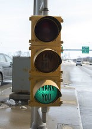
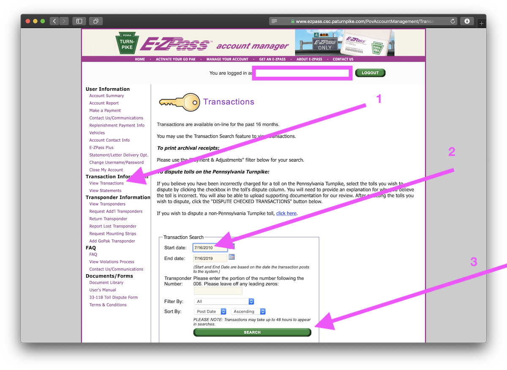
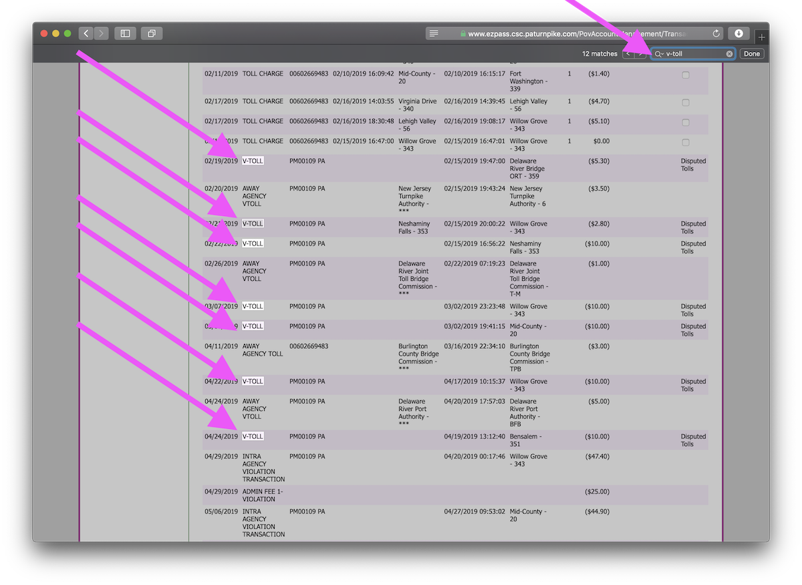
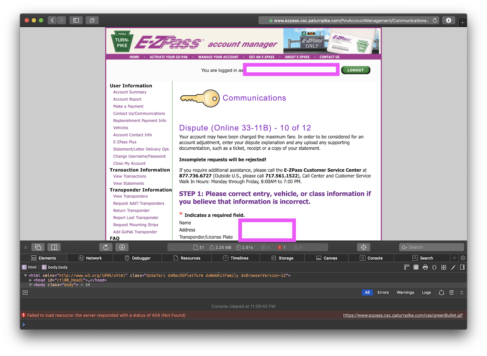
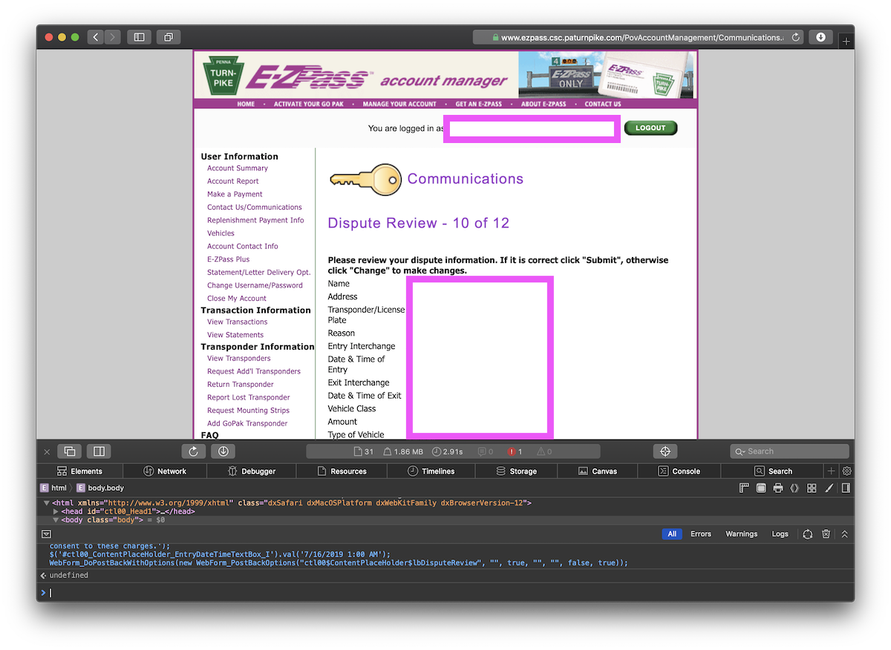
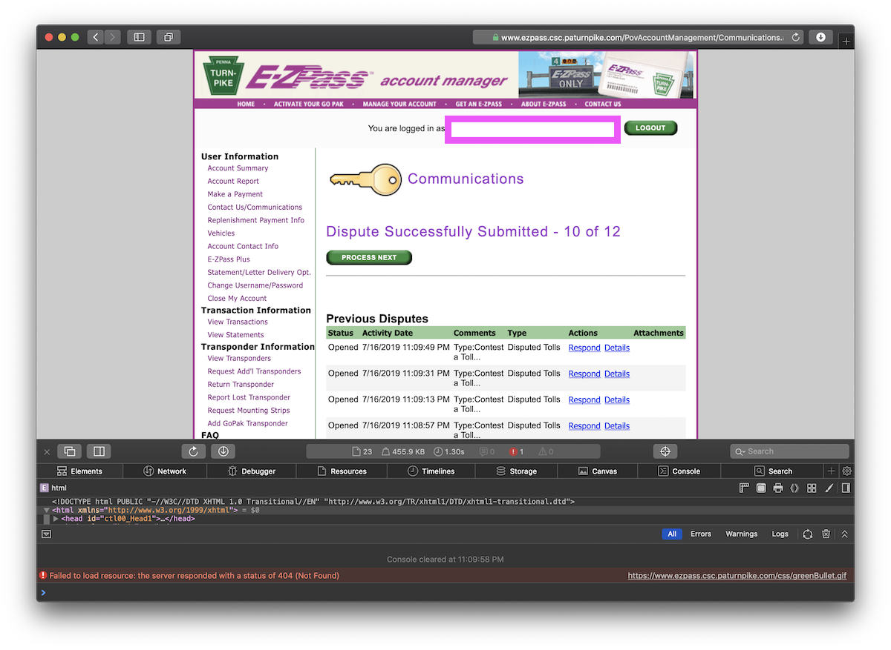
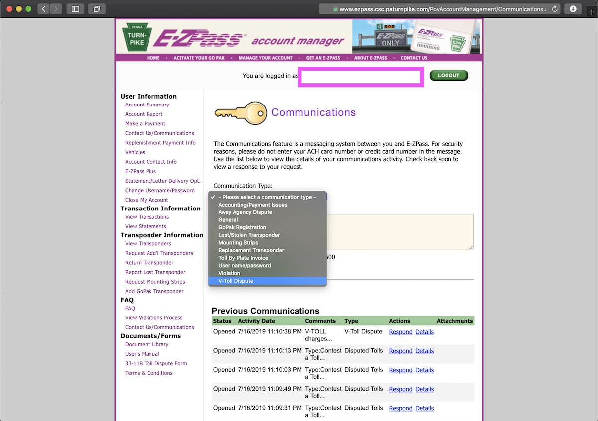

# E-ZPass V-TOLL Batch Dispute Script

*Slightly more clickbaity headline: You are probably paying tens of dollars of unnecessary fees to E-ZPass each month.*

In the past, E-ZPass toll lanes featured red-yellow-green lights which confired your payment went through and that your transponder was working.



They removed them all, did you wonder why? The reason why is because they also added a \$5 to \$10 fee every time you go through E-ZPass if "your" transponder is not working. Transponders are actually also owned by E-ZPass. These fees are silently added to your bill and charged to your credit card on file without any notification to you. This article shows you how to identify these charges, explains how difficult these charages are to dispute and introduces automated techniques to dispute the charges.

---

## Identifying "V-TOLL charges"

V-TOLL probably stands for "video toll", representing that E-ZPass was required to identify your car in an E-ZPass lane using a photograph because their transponder (which you are holding) is not working.

To identify if your account was charged V-TOLL fees, login to your E-ZPass account here. (The link is different for each state, but you will need to choose your state. All the sites are the same.)

* States: [PA](http://ezpass.csc.paturnpike.com), ((TODO: add more states here, click here to help, TODO add that link too)) ((Links may be available on each post here https://www.reddit.com/r/ezpass/))

Then click "View Transactions", set your start date to be a long time ago, click search:



Next, search this page for "V-TOLL" and "VTOLL" rows.



---

## How painful is it to dispute these charges?

Well, first you need to click the check box on each of those charges to dispute. And you will need to complete a three-page, four-section dispute form for each item.

Just to F-up their day, I have written this document for you and explaned how you can mostly automate this process.

## Autopilot dispute process

First, select all disputed items and click dispute. On each dispute item you will have three pages of content to fill in. Load the first page:



I have some extra stuff open on the bottom. You will need to "load developer tools" in your browser to see this stuff. On macOS/Safari you will also need to go to Settings->Advanced->Developer->Turn first. On my computer I need to type Command-Option-I to get this open and then I click on "Console in there".

When you have the console up, paste this in:

```javascript
// PAGE 1
$('#ctl00_ContentPlaceHolder_ddDisputeEntryInterchange').val('AKH Mainline');
$('#ctl00_ContentPlaceHolder_MakeModelTextbox').val("Various");
$('#ctl00_ContentPlaceHolder_ExplanationTextbox').val('V-TOLL charges indicate that my E-Z Pass transponder, which is property of E-Z pass, is not functioning properly. I do not consent to these charges.');
$('#ctl00_ContentPlaceHolder_EntryDateTimeTextBox_I').val('7/16/2019 1:00 AM');
WebForm_DoPostBackWithOptions(new WebForm_PostBackOptions("ctl00$ContentPlaceHolder$lbDisputeReview", "", true, "", "", false, true));
```

This will automatically fill in the above values and submit the form. And it loads the second page:



Second verse, same as the first, paste this in:

```javascript
// PAGE 2 
WebForm_DoPostBackWithOptions(new WebForm_PostBackOptions("ctl00$ContentPlaceHolder$lbDisputeSubmit", "", true, "", "", false, true));
```

That loads the third page:



Third verse, same as the first...

```javascript
// PAGE 3
WebForm_DoPostBackWithOptions(new WebForm_PostBackOptions("ctl00$ContentPlaceHolder$lbDisputeSuccessOK", "", true, "", "", false, true));
```

That completes the process. Your screen will now advance to the next disputed tool and you can repeat this process of copy-pasting code for each one. I needed to do this twelve times.

At the end, you may also see a free-form dispute form which not need to be applied to specific tolls.



They literally know everybody wants to dispute this and there is actually a category directly for this.

Next you will want to login every three months to make sure no new charges were added (so you can dispute them) and that all prior disputes were accepted.

Here is a recurring three-month calendar invite: [ICS invite](event.ics). (TODO: add Google Calendar invite and other calendar invites)

---

## Next steps

If you think E-ZPass's practices here are unacceptable, please write to your local state government representative, or research which other regulator your local E-ZPass organization is responsible to (e.g. dept of transportation) and which government person they are responsible to (e.g. legislator) which is responsible to you.

Post your letters to regulators and legisltors and refund notices publicly ((TODO: direct people to a specific place to find each other, like some reddit topic)).

Please send any correctons for this article here: ((TODO: add link to GitHub))

If you want to send me $5, [do that here](https://www.paypal.me/fulldecent/5usd).